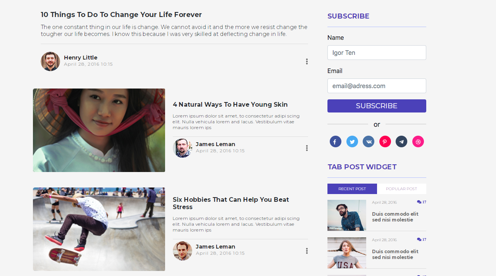

# 📝 Adaptive Sample Blog — Pure Handcrafted Layout

Классический многостраничный контентный блог с адаптивной версткой. Проект выполнен полностью вручную без использования генеративного ИИ для демонстрации глубокого понимания нативных веб-стандартов, структуры DOM и позиционирования элементов.

## 🔗 Живое демо
Посмотреть проект в браузере: **[vladimir1212.github.io/beetroot/Sample_blog](https://vladimir1212.github.io/beetroot/Sample_blog/)**

---

## 📸 Превью интерфейса


---

## 🛠️ Технологический стек и особенности

* **100% Pure Handcrafted (No AI):** Весь код написан и структурирован вручную, что гарантирует отсутствие лишнего «мусора» в разметке и идеальный контроль над каждым пикселем.
* **Архитектура CSS:** Использование продвинутых возможностей CSS3 (Flexbox и кастомные сетки Grid) для создания сложной структуры карточек и боковых панелей.
* **Pixel Perfect & Адаптивность:** Проект плавно адаптируется под любые разрешения экранов (десктопы, планшеты, смартфоны). Сетки, шрифты и изображения оптимизированы для идеального отображения на мобильных устройствах.
* **Эстетика и чистый код:** Валидная, семантически корректная HTML5 разметка, легко читаемая и готовая к SEO-оптимизации.

---

## ⚙️ Как запустить локально

1. Склонируйте репозиторий:
   ```bash
   git clone [https://github.com/Vladimir1212/beetroot.git](https://github.com/Vladimir1212/beetroot.git)
